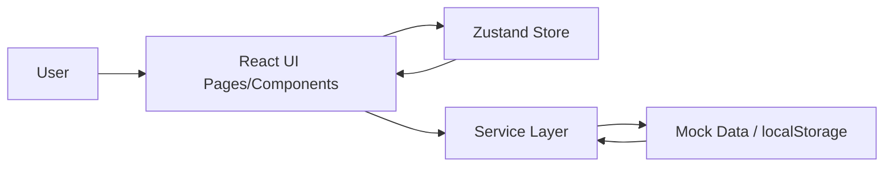

# Arsitektur Aplikasi Monitoring SIMRS

## Tujuan
Dokumen ini menjelaskan:
1. Diagram alur data aplikasi.
2. Struktur folder dan tanggung jawab utama.
3. Boundary antar modul agar coupling tetap rendah.

## Diagram Alur Data


## Struktur Folder Inti
```text
src/
├── components/      # UI reusable (card, table, badge, chart)
├── pages/           # Route-level pages
├── layouts/         # App shell (header/sidebar/layout)
├── store/           # Global state (Zustand)
├── services/        # Data/service abstraction
├── data/            # Seed/mock data
├── utils/           # Helper/formatter/workflow logic
├── constants/       # Konstanta domain
├── assets/          # Asset statis
├── App.jsx          # Route composition
└── main.jsx         # Entry point
```

## Boundary Antar Modul

### 1) `pages` ↔ `components`
- `pages` boleh mengorkestrasi state & data untuk kebutuhan tampilan halaman.
- `components` harus fokus presentasi + interaksi lokal, hindari business logic kompleks.

### 2) `pages/components` ↔ `services`
- Akses data (mock/API/localStorage) dilakukan melalui `services`.
- Hindari akses data langsung dari banyak komponen agar mudah migrasi ke backend nyata.

### 3) `store` ↔ `services`
- `store` menyimpan state global UI/domain.
- `services` menangani baca/tulis data.
- Integrasi ideal: action di store memanggil service, bukan sebaliknya.

### 4) `utils`
- Berisi fungsi pure dan reusable (formatting, workflow helper).
- Dilarang mengandung akses IO/network agar mudah ditest.

## Prinsip Implementasi
- **Single responsibility** per folder.
- **Low coupling, high cohesion** antar modul.
- **Testability**: logika bisnis dipindah dari komponen besar ke util/service agar mudah diuji.

## Rencana Evolusi
- Tambahkan lapisan `api/` saat backend aktif.
- Tambahkan `types/` atau migrasi TypeScript untuk kontrak data lebih ketat.
- Terapkan error boundary dan observability hooks untuk error runtime.
